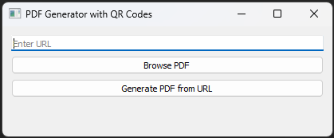
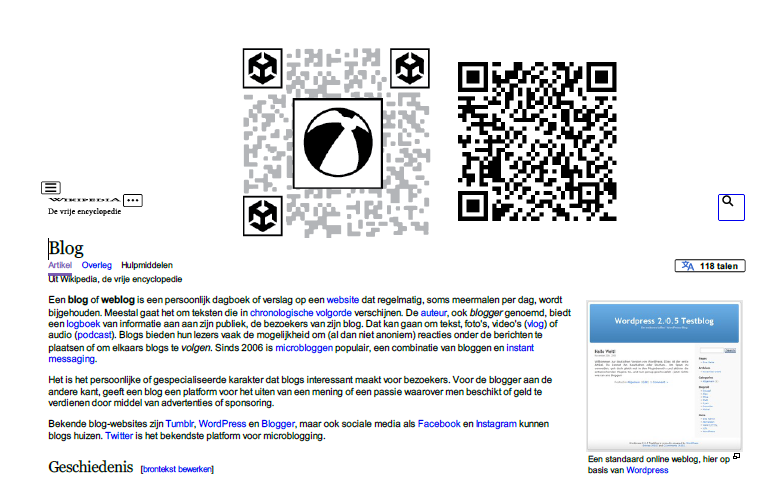
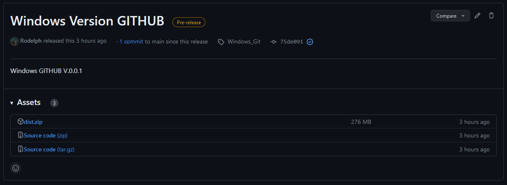
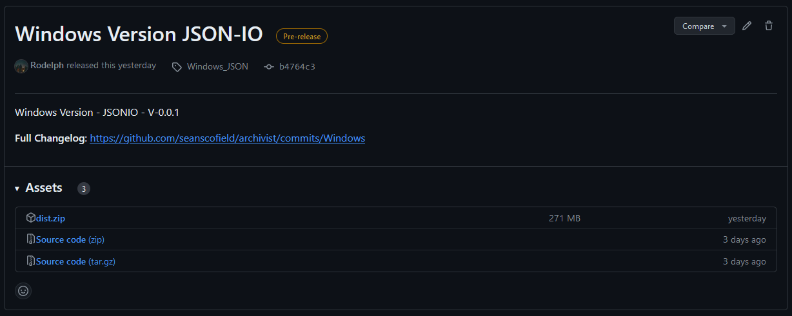

# ARchivist

## Overview

The assets I've created for this project are stored in the "Assets/CustomAssets", and are as follows:
- Hyperlinks (the name of the scene I created)
- SpawnHyperlinks (a C# script for spawning hyperlinks when an AR marker is seen on camera
- QRCodeDector (a C# script for continually monitoring for QR codes)
- CoordinateConverter (a C# script for converting between PyMuPDF coordinates and Unity AR coordinates)
- OverlayData (a C# script that defines an "Overlay" object; note that this isn't the same exact thing as the hyperlink-overlay prefab defined below, although they are somewhat similar).
- hyperlink-overlay (a prefab that I'm currently using as an AR hyperlink overlay)
- blue-semi-opaque (a semi-transparent blue material for our hyperlink overlay)
- horse_article_prototype.pdf (a pdf containing a prototype that can be used for testing)

Furthermore, the scripts for monitoring for AR markers and spawning hyperlinks are attached as components to the "AR Session Origin" object in the "Hyperlinks" scene.

If you'd like to change which AR marker to use (e.g. Kanji vs. something else), you can update the ReferenceImageLibrary that's listed as an argument to the AR Tracked Image Manager script on the "AR Session Origin" object.

**A few other notes**:
- To scan the qr code, make sure to get the camera close to the code while keeping it in focus
- This currently seems to work way better with my iphone than with my android. With the android, you really have to keep the camera relatively close to the AR marker

# Setup to run and compile from Source

1 - Install all python libraries

```
pip install -r requirements.txt
```
2 - Generate the documents to view. Using Github as a database, open the terminal in PDFGenerator directory and use the following command :
 
```
python PDFEngineGit.py
```

To use JSON-IO as a database, open the terminal in PDFGenerator directory and use the following command :
 
```
python PDFEngineIO.py
```

3 - Insert the link of the web page the you want to generate as pdf. You can even import a pdf file that is already downloaded on the computer.



4 - An output file will be created in the CacheData folder. It will contain AR markers and QR codes for the AR part.



5 - Generate Exe Files by first 

* Installing pyinstaller library from pip.
    ```
    pip install pyinstaller
    ```

* Generate the necessary files and folders for the executable file.
    ```
    pyinstaller --onefile PDFEngineIO.py
    ```
    or
    ```
    pyinstaller --onefile PDFEngineGit.py
    ```
    More info can be found in this [link](https://www.datacamp.com/tutorial/two-simple-methods-to-convert-a-python-file-to-an-exe-file).


# Run from release
- If you want to try the GITHUB version as database please download the executable file from [here](https://github.com/seanscofield/archivist/releases/tag/Windows_Git).



- If you want to try the JSONIO version as database please download the executable file from [here](https://github.com/seanscofield/archivist/releases/tag/Windows_JSON).

